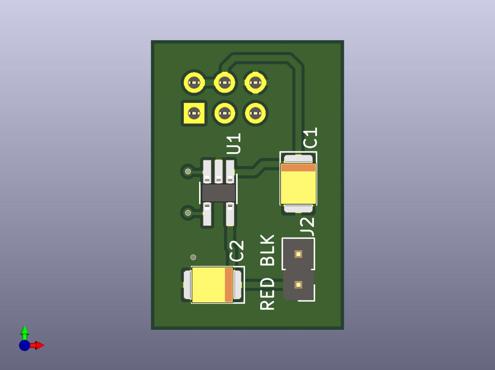

# Minimal LTC1695 Raspberry Fan Controller




This is a small fan speed controller for the Raspberry Pi. The [schematic](doc/schematic.pdf) is just one ic and two capacitors. 
The fan used is 5V DC, brushless, 2 wire, **1W max**.

## Hardware
The github contains kicad project files and python script for raspbian. This is a link to the pcb as an orderable [shared project at oshpark](https://oshpark.com/shared_projects/uS7DB7dc), and these are the components as a [shared project at Mouser](https://www.mouser.com/ProjectManager/ProjectDetail.aspx?AccessID=1c164b36e2). 

## Bill of Materials

Quant.|Prod. No.|Description
---|---|---
1|LTC1695CS5|I2C Fan Speed Controller, SOT-23
2|KEMET T494B475K020AT|Tantalum Capacitor, SMD 20V 4.7uF 1311 10% ESR=1 Ohms
1|Molex 15-44-6806|female header, 2x03, 2.54mm pitch

## Installation
The fan controller plugs into pin 1-6 of the Raspberry GPIO. If you scan the i2c bus, you ought to see the fan controller at address 0x74:
```
koen@raspberrypi:~ $ sudo i2cdetect -r -y 1
     0  1  2  3  4  5  6  7  8  9  a  b  c  d  e  f
00:          -- -- -- -- -- -- -- -- -- -- -- -- -- 
10: -- -- -- -- -- -- -- -- -- -- -- -- -- -- -- -- 
20: -- -- -- -- -- -- -- -- -- -- -- -- -- -- -- -- 
30: -- -- -- -- -- -- -- -- -- -- -- -- -- -- -- -- 
40: -- -- -- -- -- -- -- -- -- -- -- -- -- -- -- -- 
50: -- -- -- -- -- -- -- -- -- -- -- -- -- -- -- -- 
60: -- -- -- -- -- -- -- -- -- -- -- -- -- -- -- -- 
70: -- -- -- -- 74 -- -- --                         
koen@raspberrypi:~ $ 
```
You can switch the fan completely on:
```
i2cset -y 1 0x74 63
```
completely off:
```
i2cset -y 1 0x74 0
```
or something in between:
```
i2cset -y 1 0x74 32
```
At low speeds, the fan might need a little extra push to get going. If you add 64 to the speed the fan will run at full speed for 0.25s, then slow down to the programmed speed. As an example,
```
i2cset -y 1 0x74 84
```
runs the  fan at the full 5V for a quarter second to get the fan moving, then drops to 1.56V for normal operation.

Lastly, you can read the fan controller status:
```
i2cget -y 1 0x74 
```

Value | Status
--------|--------
0|ok
64|thermal shutdown (T > 155 degree C)
128|overcurrent (I > 390mA)
192|thermal shutdown *and* overcurrent

## Running

The ```raspbian``` directory contains [fanctl.py](raspbian/fanctl.py), a python script which you can run either interactively or in the background. 

variable|value|description
---|---|---
fan_min|21|minimum fan speed. fan will stall below fan_min.
fan_boost|25|fan speeds below fan_boost need 0.25s at full voltage to get fan moving first.
fan_max|63|maximum fan speed. 63 corresponds to full +5V.
temp_min|65|switch off below temp_min degrees
temp_max|85|fan at full speed at temp_max or higher

The values for *fan_min* and *fan_boost* are for the fan I'm using. The values  *temp_min* and *temp_max* represent personal choices. Once you are happy with the values, you can add the fan controller to ```/etc/rc.local``` so the fan starts up at boot:
```
/usr/local/bin/fanctl.py &
```